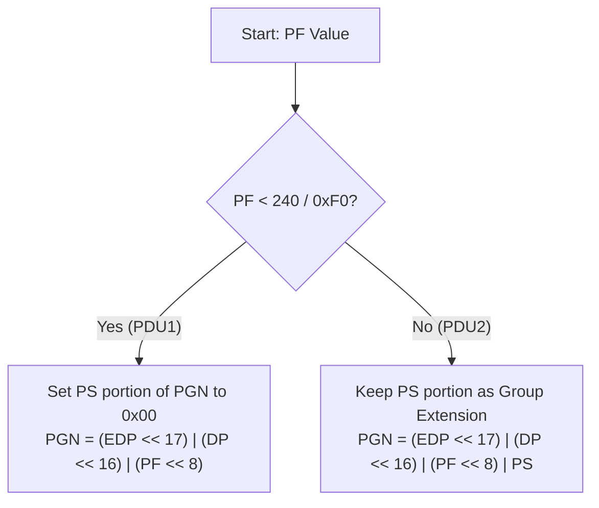

# J1939 CAN Identifier Parsing Specification

This document defines the structure of the 29-bit CAN Identifier (ID) used in SAE J1939 networks. It provides the layout, bit extraction details, and the logic required to derive the **Parameter Group Number (PGN)** and **Destination Address (DA)**.

---

## 29-Bit Identifier Structure

J1939 operates exclusively on Extended CAN (29-bit Identifier). Standard CAN (11-bit Identifier) is not used for parameter transmission in standard J1939.

### Bit Layout Table

| Bit Range | Size (Bits) | Acronym | Full Name | Description |
| :--- | :---: | :---: | :--- | :--- |
| **28 - 26** | 3 | **P** | Priority | Message priority (0 to 7; `0` is highest, `7` is lowest). Default is usually `6`. |
| **25** | 1 | **EDP** | Extended Data Page | Reserved for future extension. Must be set to `0` in standard J1939. |
| **24** | 1 | **DP** | Data Page | Selects page of auxiliary PGN definitions. Usually `0`, but `1` doubles PGN capacity. |
| **23 - 16** | 8 | **PF** | PDU Format | Determines PDU Type (PDU1 / Peer-to-Peer vs. PDU2 / Broadcast). |
| **15 - 8** | 8 | **PS** | PDU Specific | Meaning depends on PF. Either Destination Address (DA) or Group Extension (GE). |
| **7 - 0** | 8 | **SA** | Source Address | Physical address of the sending ECU (0 to 253; `254` = Null, `255` = Broadcast). |

---

## PDU Format Types

The **PDU Format (PF)** field determines how the **PDU Specific (PS)** field is interpreted. This splits the protocol into two communication modes:

* **PDU1 (Peer-to-Peer Format / PF < 240 / 0xF0)**:
  * Used for direct node-to-node communication.
  * The **PS** field contains the **Destination Address (DA)** of the receiving node.
* **PDU2 (Broadcast Format / PF >= 240 / 0xF0)**:
  * Used for broadcasting information to all nodes on the network.
  * The **PS** field acts as a **Group Extension (GE)**, expanding the number of available PGNs.
  * The destination is implicitly the **Global/Broadcast Address (`255` / `0xFF`)**.

---

## PGN & Destination Address Derivation

### 1. Parameter Group Number (PGN) Derivation
The PGN is an 18-bit identifier (commonly represented as a 24-bit integer with leading zeros) that uniquely identifies the parameter group (payload structure).



#### Derivation Logic
* **If PF < 240 (PDU1)**:
  $$\text{PGN} = (\text{EDP} \ll 17) \mid (\text{DP} \ll 16) \mid (\text{PF} \ll 8)$$
  *(Note that the PS bits are masked/replaced with `0x00` in the PGN representation).*
* **If PF >= 240 (PDU2)**:
  $$\text{PGN} = (\text{EDP} \ll 17) \mid (\text{DP} \ll 16) \mid (\text{PF} \ll 8) \mid \text{PS}$$

### 2. Destination Address (DA) Derivation
* **If PF < 240 (PDU1)**:
  $$\text{DA} = \text{PS}$$
* **If PF >= 240 (PDU2)**:
  $$\text{DA} = 255 \quad (\text{0xFF / Global Broadcast})$$

---

## Bit Extraction Masking (Reference Guide)

For implementation, use the following bitmasks and shifts on the 29-bit CAN ID:

* **Priority**: `(can_id >> 26) & 0x07`
* **Extended Data Page (EDP)**: `(can_id >> 25) & 0x01`
* **Data Page (DP)**: `(can_id >> 24) & 0x01`
* **PDU Format (PF)**: `(can_id >> 16) & 0xFF`
* **PDU Specific (PS)**: `(can_id >> 8) & 0xFF`
* **Source Address (SA)**: `can_id & 0xFF`

### Code Implementation Example (Rust)

```rust
pub struct J1939Header {
    pub priority: u8,
    pub pgn: u32,
    pub source_address: u8,
    pub destination_address: u8,
}

impl J1939Header {
    pub fn from_can_id(can_id: u32) -> Self {
        let priority = ((can_id >> 26) & 0x07) as u8;
        let edp = ((can_id >> 25) & 0x01) as u8;
        let dp = ((can_id >> 24) & 0x01) as u8;
        let pf = ((can_id >> 16) & 0xFF) as u8;
        let ps = ((can_id >> 8) & 0xFF) as u8;
        let sa = (can_id & 0xFF) as u8;

        let (pgn, da) = if pf < 240 {
            // PDU1: Peer-to-Peer
            let pgn_val = ((edp as u32) << 17) | ((dp as u32) << 16) | ((pf as u32) << 8);
            (pgn_val, ps)
        } else {
            // PDU2: Broadcast
            let pgn_val = ((edp as u32) << 17) | ((dp as u32) << 16) | ((pf as u32) << 8) | (ps as u32);
            (pgn_val, 255) // Global destination
        };

        Self {
            priority,
            pgn,
            source_address: sa,
            destination_address: da,
        }
    }
}
```
