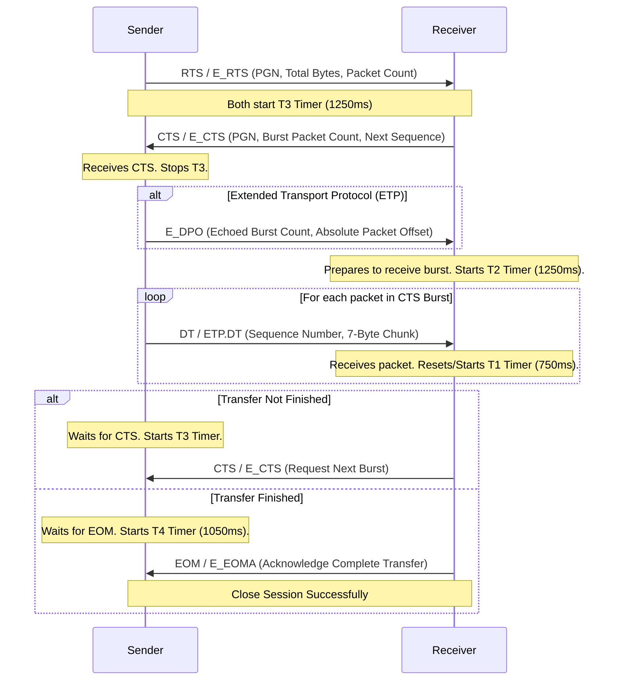

# J1939 Stack Control Protocols & Timing Specification

This document details the essential communication sub-protocols, management messages, and critical timeouts required to build a compliant J1939 stack.

---

## 1. Request Message (PGN 59904 / 0xEA00)

Used to poll another node (or all nodes) for a specific Parameter Group Number (PGN).

* **Format**: PDU1 (can be Peer-to-Peer or Broadcast)
* **Data Length**: 3 bytes
* **Payload Structure**:
  * **Bytes 1-3**: Requested PGN (stored in Little-Endian format).
* **Behavior**:
  * **Unicast Request**: If sent to a specific Destination Address (DA), the receiving node must respond. If the PGN is supported, it transmits it. If not, it transmits an **Acknowledgment (NACK)**.
  * **Broadcast Request**: If sent to DA `255`, only nodes that support the requested PGN respond. Nodes that do not support it remain silent (do not send NACKs).

---

## 2. Acknowledgment Message (PGN 59392 / 0xE800)

Provides handshake responses to requests, command commands, or safety-critical PGNs.

* **Format**: PDU1 (typically Peer-to-Peer)
* **Data Length**: 8 bytes
* **Payload Structure**:
  * **Byte 1**: Control Byte (Acknowledgment Type)
    * `0`: **ACK** (Positive Acknowledgment)
    * `1`: **NACK** (Negative Acknowledgment / Not Supported)
    * `2`: **Access Denied** (Security/Permission restriction)
    * `3`: **Busy / Cannot Respond**
  * **Byte 2**: Group Function Value (typically `0xFF` if unused)
  * **Bytes 3-5**: Reserved (set to `0xFF`)
  * **Bytes 6-8**: The PGN to which this acknowledgment applies (Little-Endian).

---

## 3. Standard J1939 Transport Protocol (TP)

Used to transmit messages containing **9 to 1785 bytes** of data. Standard CAN frames can only carry up to 8 bytes.

### Dedicated Parameter Groups
* **TP.CM (Connection Management - PGN 60416 / 0xEC00)**: Used for setup, flow control, and teardown.
* **TP.DT (Data Transfer - PGN 60160 / 0xEB00)**: Carries the fragmented data chunks.

### TP.CM Packet Formats

#### 1. Request to Send (RTS) — Control Byte: `0x10`
Sent by the sender to initiate a point-to-point (unicast) session.

| Byte Offset | Size (Bytes) | Field Description |
| :---: | :---: | :--- |
| **0** | 1 | Control Byte = `0x10` |
| **1 - 2** | 2 | Total message size in bytes (`9` to `1785`, Little-Endian) |
| **3** | 1 | Total number of packets required (`ceil(total_bytes / 7.0)`) |
| **4** | 1 | Maximum number of packets that can be sent in response to a single CTS (set to `0xFF` if unlimited) |
| **5 - 7** | 3 | Parameter Group Number (PGN) of the message being sent (Little-Endian) |

#### 2. Clear to Send (CTS) — Control Byte: `0x11`
Sent by the receiver to authorize the sender to transmit a burst of packets.

| Byte Offset | Size (Bytes) | Field Description |
| :---: | :---: | :--- |
| **0** | 1 | Control Byte = `0x11` |
| **1** | 1 | Number of packets allowed in the next burst (can be `0` to hold/pause transmission) |
| **2** | 1 | Next packet sequence number expected (`1` to `255`) |
| **3 - 4** | 2 | Reserved (set to `0xFF`) |
| **5 - 7** | 3 | PGN of the message being transferred (Little-Endian) |

#### 3. End of Message Acknowledgment (EOM) — Control Byte: `0x13`
Sent by the receiver to confirm successful receipt of the entire message.

| Byte Offset | Size (Bytes) | Field Description |
| :---: | :---: | :--- |
| **0** | 1 | Control Byte = `0x13` |
| **1 - 2** | 2 | Total message size received in bytes (Little-Endian) |
| **3** | 1 | Total number of packets successfully received |
| **4** | 1 | Reserved (set to `0xFF`) |
| **5 - 7** | 3 | PGN of the message being transferred (Little-Endian) |

#### 4. Connection Abort — Control Byte: `0x1C`
Sent by either node to terminate the session immediately due to an error, timeout, or resource limit.

| Byte Offset | Size (Bytes) | Field Description |
| :---: | :---: | :--- |
| **0** | 1 | Control Byte = `0x1C` |
| **1** | 1 | Connection Abort Reason code (see list below) |
| **2 - 4** | 3 | Reserved (set to `0xFF`) |
| **5 - 7** | 3 | PGN of the message being aborted (Little-Endian) |

##### Standard Abort Reason Codes
* **`1`**: Already in a connection (busy).
* **`2`**: Lack of resources (no buffer space).
* **`3`**: Timeout (T1, T2, T3, or T4 expired).
* **`4`**: CTS received while data transfer was already in progress.
* **`5`**: Maximum retransmission limit exceeded.
* **`255`**: General or unspecified error.

#### 5. Broadcast Announce Message (BAM) — Control Byte: `0x20`
Sent by the sender to initiate a broadcast session to all nodes (DA = `255`).

| Byte Offset | Size (Bytes) | Field Description |
| :---: | :---: | :--- |
| **0** | 1 | Control Byte = `0x20` |
| **1 - 2** | 2 | Total message size in bytes (`9` to `1785`, Little-Endian) |
| **3** | 1 | Total number of packets required (`ceil(total_bytes / 7.0)`) |
| **4** | 1 | Reserved (set to `0xFF`) |
| **5 - 7** | 3 | PGN of the message being broadcast (Little-Endian) |

---

### TP.DT Packet Format (PGN 60160)

Carries the raw fragmented data chunks. Every TP.DT packet must contain exactly 8 bytes of data.

| Byte Offset | Size (Bytes) | Field Description |
| :---: | :---: | :--- |
| **0** | 1 | Sequence Number (`1` to `255`) |
| **1 - 7** | 7 | Fragment Payload. If the final packet contains fewer than 7 bytes of actual data, the remaining bytes MUST be padded with `0xFF`. |

---

## 4. ISOBUS Extended Transport Protocol (ETP)

Used to transmit messages containing **1786 to 117,440,512 bytes (117 MB)** of data. ETP is exclusively point-to-point (unicast) and does not support broadcast/BAM mode.

### Dedicated Parameter Groups
* **ETP.CM (Extended Connection Management - PGN 51200 / 0xC800)**: Session control.
* **ETP.DT (Extended Data Transfer - PGN 50944 / 0xC700)**: Data packets.

### ETP.CM Packet Formats

#### 1. Extended Request to Send (E_RTS) — Control Byte: `0x14`
Sent by the sender to initiate an ETP unicast session.

| Byte Offset | Size (Bytes) | Field Description |
| :---: | :---: | :--- |
| **0** | 1 | Control Byte = `0x14` |
| **1** | 1 | Maximum number of packets allowed in a single block burst (typically `0xFF`) |
| **2 - 4** | 3 | Total message size in bytes (24-bit integer, Little-Endian, up to `117,440,512`) |
| **5 - 7** | 3 | PGN of the message being sent (Little-Endian) |

#### 2. Extended Clear to Send (E_CTS) — Control Byte: `0x15`
Sent by the receiver to authorize the sender to transmit a block burst.

| Byte Offset | Size (Bytes) | Field Description |
| :---: | :---: | :--- |
| **0** | 1 | Control Byte = `0x15` |
| **1** | 1 | Number of packets allowed in the next block burst (can be `0` to hold/pause transmission) |
| **2** | 1 | Next packet sequence number expected (`1` to `255`, wrapping to `0` after `255`) |
| **3 - 4** | 2 | Reserved (set to `0xFF`) |
| **5 - 7** | 3 | PGN of the message being transferred (Little-Endian) |

#### 3. Extended Data Packet Offset (E_DPO) — Control Byte: `0x16`
Sent by the sender immediately following an E_CTS, right before starting the next ETP.DT data burst. It states the absolute packet offset to allow sequence verification.

| Byte Offset | Size (Bytes) | Field Description |
| :---: | :---: | :--- |
| **0** | 1 | Control Byte = `0x16` |
| **1** | 1 | Number of packets allowed (echoed from E_CTS Byte 1) |
| **2 - 4** | 3 | Data Packet Offset (24-bit integer, Little-Endian). Represents the absolute number of packets already successfully transmitted. |
| **5 - 7** | 3 | PGN of the message being transferred (Little-Endian) |

#### 4. Extended End of Message Acknowledgment (E_EOMA) — Control Byte: `0x17`
Sent by the receiver to confirm successful receipt of the entire large message.

| Byte Offset | Size (Bytes) | Field Description |
| :---: | :---: | :--- |
| **0** | 1 | Control Byte = `0x17` |
| **1 - 3** | 3 | Total message size received in bytes (24-bit, Little-Endian) |
| **4** | 1 | Reserved (set to `0xFF`) |
| **5 - 7** | 3 | PGN of the message being transferred (Little-Endian) |

#### 5. Extended Connection Abort (E_Abort) — Control Byte: `0xFF`
Sent by either node to terminate the ETP session due to an error, timeout, or sequence mismatch.

| Byte Offset | Size (Bytes) | Field Description |
| :---: | :---: | :--- |
| **0** | 1 | Control Byte = `0xFF` |
| **1** | 1 | Abort Reason code (identical to standard TP abort reasons) |
| **2 - 4** | 3 | Reserved (set to `0xFF`) |
| **5 - 7** | 3 | PGN of the message being aborted (Little-Endian) |

---

### ETP.DT Packet Format (PGN 50944)

Carries raw data packets. Every ETP.DT frame must contain exactly 8 bytes of data.

| Byte Offset | Size (Bytes) | Field Description |
| :---: | :---: | :--- |
| **0** | 1 | Sequence Number (`1` to `255`, wrapping to `0` and then `1` to `255`, etc.) |
| **1 - 7** | 7 | Fragment Payload. Remaining unused bytes in the last frame must be padded with `0xFF`. |

---

## 5. Timing, Handshakes, & State Flow

To ensure stack stability and prevent lockups, you must implement the following timer limits (T1 to T4):

### Timeouts Table

| Timeout | Value | Triggered By | Expected Response | Description |
| :---: | :---: | :--- | :--- | :--- |
| **T1** | **750 ms** | Data receiver | Receipt of next DT packet | Timeout between consecutive data packets in a burst. |
| **T2** | **1250 ms** | Data receiver | Receipt of next DT packet | Timeout after receiver transmits CTS to wait for the first DT packet of the burst. |
| **T3** | **1250 ms** | Data sender | Receipt of CTS from receiver | Timeout after sender transmits RTS or finishes a DT burst. |
| **T4** | **1050 ms** | Data sender | Receipt of EOM / EOMA | Timeout after sender transmits final DT packet of the transfer. |
| **BAM** | **50 - 200 ms** | Data sender | N/A (Broadcast) | **BAM Spacing**: Delay between transmitting consecutive broadcast DT packets. |

---

## 6. Implementation & Corner Case Handling Guidelines

### 1. Unicast Handshake Sequence

The normal point-to-point sequence is as follows:

### 2. CTS-to-Hold (Flow Control Pause)
* **Receiver Action**: If the receiver becomes temporarily busy (e.g., waiting for buffer clearance or writing to disk), it can send a CTS / E_CTS with the **Number of Packets set to `0`**.
* **Sender Action**: Upon receiving a CTS-to-hold, the sender must pause transmission, stop its active data timers, and start the T3 timer (1250ms) waiting for a resume CTS.
* **Timers**: To keep the session alive, the receiver must send a new CTS (either a resume CTS with packets > 0, or another CTS-to-hold) before T2 (1250ms) expires. It is recommended to limit consecutive holds to **10 retries** before aborting.

### 3. Sequence Wrapping in ETP
* **Rolling Sequence**: In ETP.DT, the sequence number field is a single byte. It starts at `1` for the first packet of the transfer and increments up to `255`. The next packet sequence number MUST wrap to `0`, and then increment to `255` again (i.e., `1 -> 255 -> 0 -> 255 -> 0...`).
* **Offset Verification**: The receiver uses the 24-bit Data Packet Offset ($N_{DPO}$) sent in the `E_DPO` frame to determine the absolute index of incoming packets. For any packet with sequence number $S$ in the current burst:
  * **If $S \ge 1$**: Absolute Packet Index = $N_{DPO} + S - 1$
  * **If $S = 0$**: Absolute Packet Index = $N_{DPO} + 254$

### 4. Retries & Error Recovery
* **No Packet-Level Retries**: J1939 does not support re-transmitting individual corrupted or missing packets. If a packet is lost (T1/T2 timeout) or received out of sequence, the node must transmit a **Connection Abort** frame and clear the session state.
* **RTS/CTS Handshake Retries**: 
  * If the sender transmits RTS but receives no CTS within T3 (1250ms), it may retry sending RTS up to **2 times** before giving up.
  * If the receiver transmits a CTS but receives no DT packet within T2 (1250ms), it may retry sending the CTS up to **2 times** before sending an Abort.
  * Once the first data packet (`DT` / `ETP.DT`) of a session is successfully sent/received, **no further retries are allowed**. Any subsequent timeout (T1, T2, T3, T4) or sequence mismatch must trigger an immediate Abort.

### 5. Corner Cases & Conflicts
* **Duplicate RTS from Same Node**: If a receiver is in the middle of a session with Sender A and receives a new RTS/E_RTS from Sender A, it must immediately abort the active session and initiate a new session using the parameters of the new RTS.
* **Duplicate RTS from Different Node**: If a receiver is busy in a session with Sender A and receives an RTS/E_RTS from Sender B, the receiver must immediately send a **Connection Abort** frame to Sender B with reason **`1` (Busy / Already in connection)**. The session with Sender A must continue uninterrupted.
* **Unexpected DT Frame**: If a node receives a `TP.DT` or `ETP.DT` frame when it does not have an active session registered for that sender, the frame must be silently discarded. To avoid bus noise triggering abort cascades, do not send abort frames for unsolicited data transfer packets.
* **Unexpected CTS or EOM Frame**: If a node receives CTS, EOM, E_CTS, or E_EOMA when not in an active session, it should respond with a **Connection Abort** targeting the sender's address to clear the remote node's hung state.
* **Payload Padding & Truncation**:
  * The sender must transmit exactly 8 bytes in every data frame.
  * If the message size is not a multiple of 7, the sender must pad the remaining bytes of the last frame with `0xFF`.
  * The receiver must allocate a buffer matching the exact size specified in the RTS / E_RTS, read only that number of bytes, and truncate any trailing padding bytes (`0xFF`) from the last packet.

